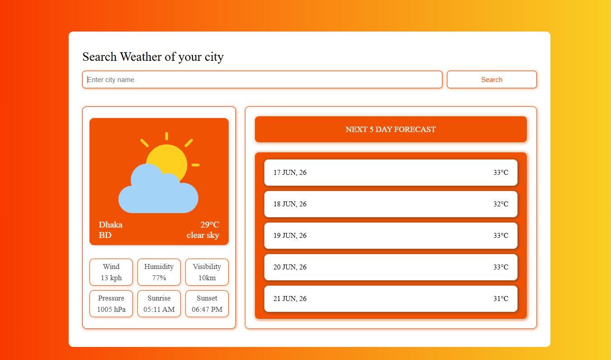
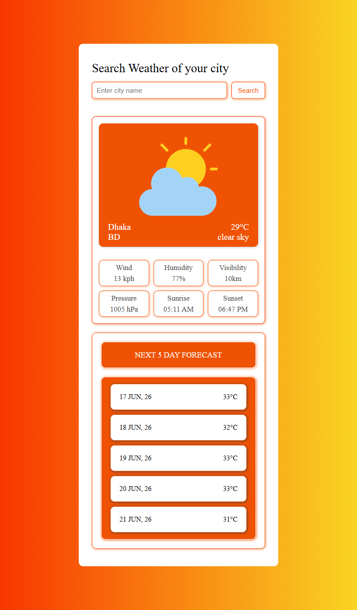

# 🌤️ Weather Forecast App

A clean and responsive weather application built using **HTML, CSS, and Vanilla JavaScript**.  
It uses the **OpenWeather API** to display real-time weather data and a 5-day forecast.

---

## 🚀 Live Demo

👉 https://your-project.vercel.app

---

## 📸 Preview




---

## ✨ Features

- 🔍 Search weather by city name
- 🌡️ Real-time temperature display
- 🌥️ Weather condition description
- 🌬️ Wind speed, humidity, pressure, visibility
- 🌅 Sunrise and sunset timing
- 📅 5-day forecast (filtered at 12:00 PM)
- 🎨 Clean and modern UI design
- 📱 Responsive layout

---

## 🛠️ Tech Stack

- HTML5
- CSS3 (Grid + Flexbox)
- JavaScript (ES6)
- OpenWeather API

---

## 📡 APIs Used

- Current Weather API  
- 5 Day / 3 Hour Forecast API  

---

## ⚙️ How It Works

1. User enters a city name
2. App fetches data from OpenWeather API
3. Current weather is displayed
4. Forecast data is filtered to show one entry per day (12:00 PM)
5. UI updates dynamically

---

## 📁 Project Structure
```weather-project-fizz/
|── assets/
    |── desktop.png
    |── phone.png
│── index.html
│── style.css
│── logic.js
```


---

## ⚙️ Getting Started

Clone the repository:

```bash
git clone https://github.com/your-username/weather-app.git
```

Navigate to the project folder:

```bash
cd weather-project-fizz
```

Open `index.html` in your browser.

## 🧠 What I Learned

While building this project, I practiced:

- Working with REST APIs
- Fetching data using JavaScript (fetch API)
- Asynchronous programming (async/await)
- DOM manipulation
- Data filtering and transformation
- Handling user input and events
- Working with timestamps and date formatting
- Building responsive UI layouts

---

## 🚀 Future Improvements

- Weather condition animations (rain, sun, clouds)
- Dark mode support
- Loading spinner during API calls
- Better error handling for invalid cities
- Geolocation-based weather detection
- Improved mobile responsiveness

---

## 👨‍💻 Author

Built by MUSTAFIZUR RAHMAN as part of my JavaScript learning journey.

GitHub: https://github.com/mrfizz17

---

## 📜 License

This project is open-source and free to use for learning and portfolio purposes.

